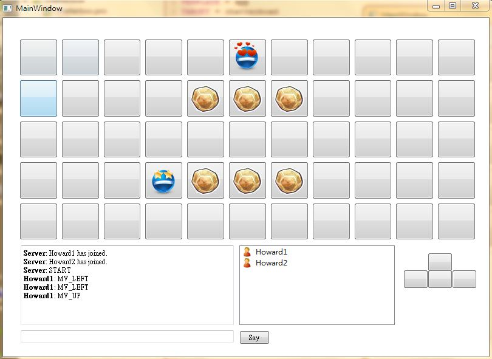

# Bomberman on Tiny210

### Introduction
We present a simple multi-player online game on ARM's Tiny210. It's a client-server application implemented in C++ with QT framework. Two players each control a bomberman while the one survived in the end win. The bombermen can place multiple time bombs on the map. When a bomb explode, the bombermen on the same row or column will lose their life points. Sometimes, useful gadgets will randomly appear on the map to make the game more exciting. 

